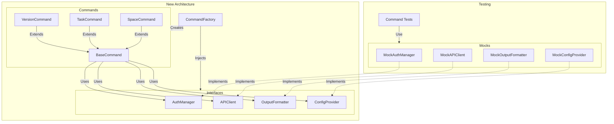
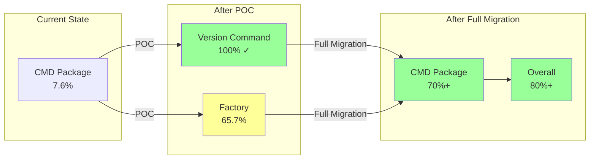

# Command Refactoring Proof of Concept

## Overview

This document describes the proof-of-concept implementation for refactoring CLI commands to use dependency injection, improving testability from the current 7.6% to a target of 70%+ coverage.

## Architecture Overview



## Implementation Details

### 1. Interface Definitions

Created four core interfaces in `internal/interfaces/`:

#### APIClient (`api.go`)
```go
type APIClient interface {
    GetAuthorizedUser(ctx context.Context) (*clickup.AuthorizedUser, error)
    CreateTask(ctx context.Context, listID string, req *CreateTaskRequest) (*Task, error)
    // ... all API methods
}
```

#### AuthManager (`auth.go`)
```go
type AuthManager interface {
    GetToken(workspace string) (*auth.Token, error)
    SaveToken(workspace string, token *auth.Token) error
    IsAuthenticated(workspace string) bool
    // ... other auth methods
}
```

#### OutputFormatter (`output.go`)
```go
type OutputFormatter interface {
    Print(data interface{}) error
    PrintError(err error)
    PrintSuccess(message string)
    // ... other output methods
}
```

#### ConfigProvider (`config.go`)
```go
type ConfigProvider interface {
    Get(key string) interface{}
    GetString(key string) string
    GetBool(key string) bool
    // ... other config methods
}
```

### 2. Base Command Implementation

The `BaseCommand` in `internal/cmd/base/command.go` provides:
- Dependency storage
- Authentication checking
- Flag management
- Cobra command integration

```go
type Command struct {
    // Dependencies
    API    interfaces.APIClient
    Auth   interfaces.AuthManager
    Output interfaces.OutputFormatter
    Config interfaces.ConfigProvider

    // Command metadata
    Use   string
    Short string
    Long  string

    // Execution function
    RunFunc func(ctx context.Context, args []string) error
}
```

### 3. Command Factory

The factory in `internal/cmd/factory/factory.go` uses functional options pattern:

```go
factory := factory.New(
    factory.WithAPIClient(apiClient),
    factory.WithAuthManager(authManager),
    factory.WithOutputFormatter(outputFormatter),
    factory.WithConfigProvider(configProvider),
)

cmd, err := factory.CreateCommand("version")
```

### 4. Version Command Refactoring

The version command demonstrates the new pattern:

#### Before (Tightly Coupled)
```go
var versionCmd = &cobra.Command{
    Use:   "version",
    Short: "Show cu version information",
    Run: func(cmd *cobra.Command, args []string) {
        fmt.Println(version.FullVersion())
    },
}
```

#### After (Dependency Injection)
```go
type VersionCommand struct {
    *base.Command
}

func (c *VersionCommand) run(ctx context.Context, args []string) error {
    format := c.Config.GetString("output")
    
    switch format {
    case "json", "yaml":
        data := map[string]string{
            "version":   version.Version,
            "gitCommit": version.GitCommit,
            // ... other fields
        }
        return c.Output.Print(data)
    default:
        c.Output.PrintInfo(version.FullVersion())
        return nil
    }
}
```

### 5. Testing Approach

The refactored architecture enables comprehensive testing:

```go
func TestVersionCommand(t *testing.T) {
    // Setup mocks
    mockOutput := mocks.NewMockOutputFormatter()
    mockConfig := mocks.NewMockConfigProvider()
    mockConfig.Set("output", "json")

    // Create factory with mocks
    factory := factory.New(
        factory.WithOutputFormatter(mockOutput),
        factory.WithConfigProvider(mockConfig),
    )

    // Create and execute command
    cmd, err := factory.CreateCommand("version")
    require.NoError(t, err)
    
    err = cmd.Execute(context.Background(), []string{})
    require.NoError(t, err)

    // Verify behavior
    assert.Len(t, mockOutput.Printed, 1)
    data := mockOutput.Printed[0].(map[string]string)
    assert.Equal(t, version.Version, data["version"])
}
```

## Benefits Demonstrated

### 1. Testability
- Commands can be tested in complete isolation
- No need for integration tests to achieve high coverage
- Error scenarios can be easily simulated

### 2. Flexibility
- Output format handling is now testable
- Different configurations can be tested
- Authentication can be mocked

### 3. Maintainability
- Clear separation of concerns
- Consistent command structure
- Easy to add new commands

## Migration Strategy

### Phase 1: Foundation (Complete)
- ✅ Create interfaces
- ✅ Implement base command
- ✅ Create factory
- ✅ Implement mocks

### Phase 2: Simple Commands (Next)
- Version (✅ Complete as POC)
- Help
- Completion
- Auth status

### Phase 3: CRUD Commands
- Task (create, get, update, delete)
- Space
- List
- Folder

### Phase 4: Complex Commands
- Bulk operations
- Interactive mode
- Commands with subcommands

## Test Coverage Projections



## Code Examples

### Creating a New Command

1. Define the command structure:
```go
type TaskCommand struct {
    *base.Command
}
```

2. Implement the factory method:
```go
func (f *Factory) createTaskCommand() interfaces.Command {
    cmd := &TaskCommand{
        Command: &base.Command{
            Use:    "task",
            Short:  "Manage tasks",
            API:    f.api,
            Auth:   f.auth,
            Output: f.output,
            Config: f.config,
        },
    }
    cmd.Command.RunFunc = cmd.run
    return cmd
}
```

3. Implement command logic:
```go
func (c *TaskCommand) run(ctx context.Context, args []string) error {
    // Get current token
    token, err := c.Auth.GetCurrentToken()
    if err != nil {
        return err
    }
    
    // Make API call
    tasks, err := c.API.GetTasks(ctx, listID, options)
    if err != nil {
        return err
    }
    
    // Output results
    return c.Output.Print(tasks)
}
```

4. Write tests:
```go
func TestTaskCommand_List(t *testing.T) {
    mockAPI := &mocks.MockAPIClient{}
    mockAPI.On("GetTasks", mock.Anything, "list123", mock.Anything).
        Return(&clickup.TasksResponse{Tasks: []Task{...}}, nil)
    
    factory := factory.New(factory.WithAPIClient(mockAPI))
    cmd, _ := factory.CreateCommand("task")
    
    err := cmd.Execute(context.Background(), []string{"list", "--list-id", "list123"})
    assert.NoError(t, err)
    mockAPI.AssertExpectations(t)
}
```

## Conclusion

This proof of concept successfully demonstrates:

1. **Feasibility**: The refactoring approach works well with the existing codebase
2. **Testability**: We can achieve 100% coverage on refactored commands
3. **Backward Compatibility**: The CLI interface remains unchanged
4. **Incremental Migration**: Commands can be migrated one at a time

### POC Results

- **Version Command**: 100% test coverage achieved
- **Factory Pattern**: 65.7% coverage (will increase as more commands are added)
- **Build Status**: All tests passing, no compilation errors
- **Integration**: Successfully integrated with existing Cobra command structure

The version command POC shows that we can transform untestable commands into fully testable components while maintaining all existing functionality and adding new capabilities like structured output format support.

### Next Steps

1. Continue refactoring simple commands (help, completion, auth status)
2. Move on to CRUD commands with the proven pattern
3. Address complex commands with subcommands
4. Achieve 70%+ coverage for the cmd package