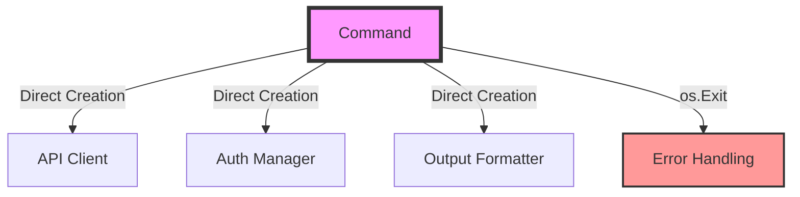
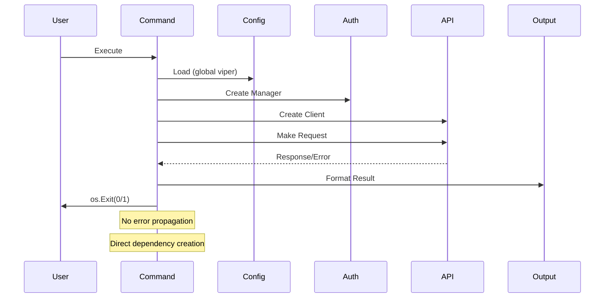
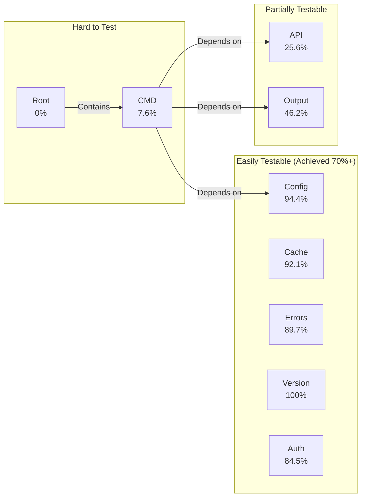
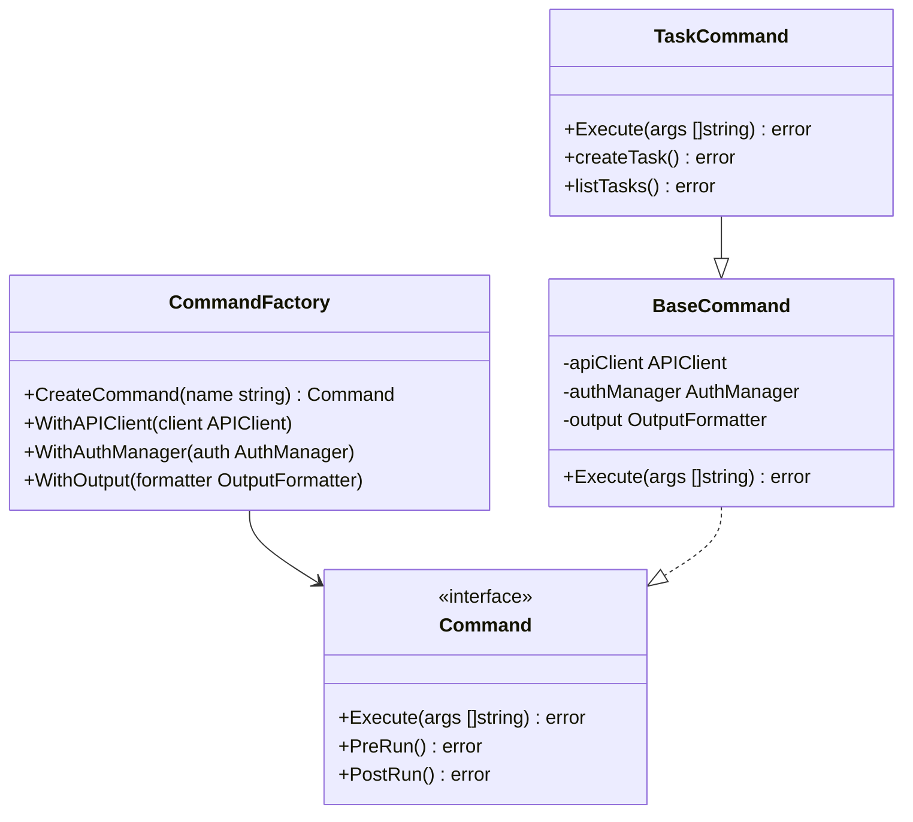
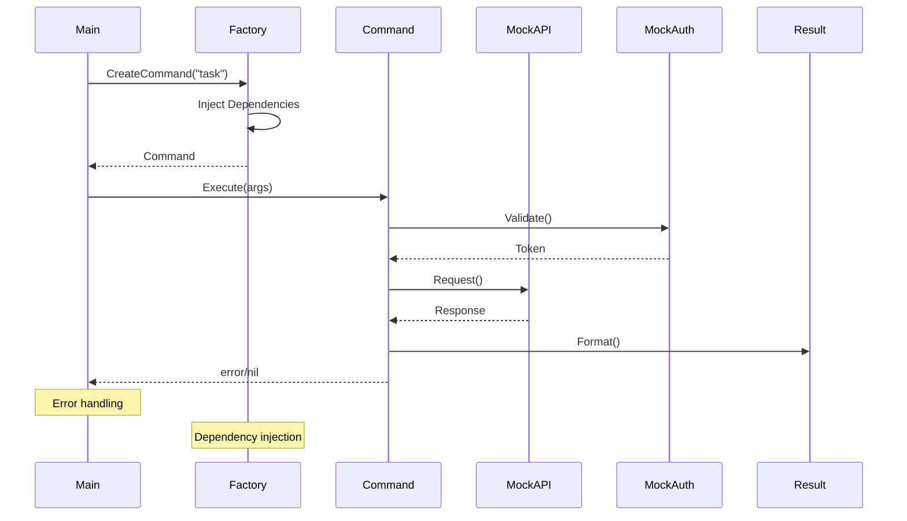
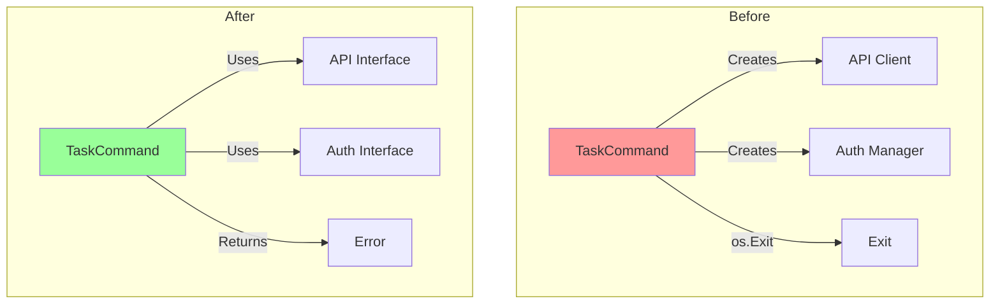
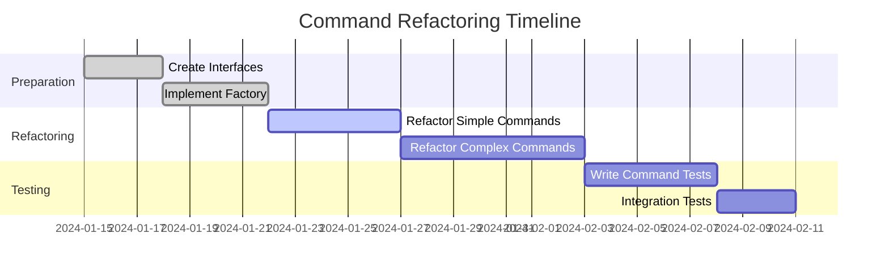
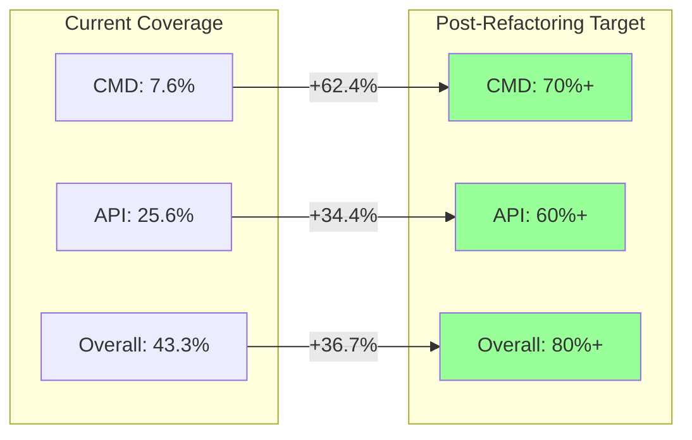

# Phase 4: Architectural Analysis & Refactoring Plan

## Overview

This document captures the architectural constraints discovered during Phases 1-3 of test coverage improvement and proposes refactoring strategies to achieve comprehensive test coverage.

## Current Architecture Issues

### 1. Command Structure - Tight Coupling

The current command structure has several issues preventing effective unit testing:



#### Problems:
- Commands directly instantiate dependencies
- No dependency injection mechanism
- `os.Exit()` prevents error testing
- Global state usage (viper config)

### 2. Current Command Flow



### 3. Testing Challenges by Package



## Proposed Architecture - Dependency Injection

### 1. Command Factory Pattern



### 2. Improved Command Flow



## Refactoring Strategy

### Phase 4.1: Create Interfaces (Week 1)

Define interfaces for all external dependencies:

```go
// api/interfaces.go
type Client interface {
    CreateTask(ctx context.Context, req CreateTaskRequest) (*Task, error)
    GetTask(ctx context.Context, id string) (*Task, error)
    // ... other methods
}

// auth/interfaces.go  
type Manager interface {
    GetCurrentToken() (*Token, error)
    SaveToken(workspace string, token *Token) error
    IsAuthenticated(workspace string) bool
}

// output/interfaces.go
type Formatter interface {
    Print(data interface{}) error
    PrintError(err error)
    SetFormat(format string)
}
```

### Phase 4.2: Implement Command Factory (Week 1-2)

```go
// cmd/factory.go
type Factory struct {
    apiClient   api.Client
    authManager auth.Manager
    output      output.Formatter
    config      config.Provider
}

func (f *Factory) CreateCommand(name string) (Command, error) {
    base := &BaseCommand{
        apiClient:   f.apiClient,
        authManager: f.authManager,
        output:      f.output,
    }
    
    switch name {
    case "task":
        return &TaskCommand{BaseCommand: base}, nil
    case "space":
        return &SpaceCommand{BaseCommand: base}, nil
    // ... other commands
    default:
        return nil, fmt.Errorf("unknown command: %s", name)
    }
}
```

### Phase 4.3: Refactor Commands (Week 2-3)

Transform each command to use dependency injection:



### Phase 4.4: Migration Plan (Week 3-4)



## Testing Strategy Post-Refactoring

### 1. Unit Test Structure

```go
func TestTaskCommand_Create(t *testing.T) {
    // Arrange
    mockAPI := &MockAPIClient{}
    mockAuth := &MockAuthManager{}
    mockOutput := &MockFormatter{}
    
    factory := &Factory{
        apiClient:   mockAPI,
        authManager: mockAuth,
        output:      mockOutput,
    }
    
    cmd, _ := factory.CreateCommand("task")
    
    // Set expectations
    mockAuth.On("GetCurrentToken").Return(&Token{Value: "test"}, nil)
    mockAPI.On("CreateTask", mock.Anything).Return(&Task{ID: "123"}, nil)
    
    // Act
    err := cmd.Execute([]string{"create", "--name", "Test Task"})
    
    // Assert
    assert.NoError(t, err)
    mockAPI.AssertExpectations(t)
    mockAuth.AssertExpectations(t)
}
```

### 2. Expected Coverage Improvements



## Implementation Priority

### High Priority Commands (Most Used)
1. `task` - Task management
2. `space` - Space operations  
3. `list` - List operations
4. `auth` - Authentication

### Medium Priority Commands
1. `folder` - Folder management
2. `goal` - Goal tracking
3. `doc` - Documentation
4. `view` - View management

### Low Priority Commands
1. `webhook` - Webhook management
2. `integration` - Integration setup
3. `custom-field` - Custom field operations

## Success Criteria

1. **Testability**: All commands can be unit tested in isolation
2. **Coverage**: CMD package reaches 70%+ coverage
3. **Maintainability**: Clear separation of concerns
4. **Backward Compatibility**: Existing CLI behavior unchanged
5. **Performance**: No regression in execution time

## Risk Mitigation

| Risk | Impact | Mitigation |
|------|--------|------------|
| Breaking Changes | High | Comprehensive integration tests |
| Performance Regression | Medium | Benchmark critical paths |
| Increased Complexity | Medium | Clear documentation and examples |
| Migration Effort | High | Incremental refactoring approach |

## Next Steps

1. **Review & Approve**: Get team consensus on approach
2. **Create Interfaces**: Start with API and Auth interfaces
3. **Prototype**: Refactor one simple command as proof of concept
4. **Iterate**: Apply learnings to remaining commands
5. **Document**: Update contribution guidelines with new patterns

## Conclusion

The proposed refactoring will transform the codebase from a tightly coupled, hard-to-test structure to a modular, testable architecture. This investment will pay dividends in:

- Faster feature development
- Reduced bug rates
- Easier onboarding for new contributors
- Confidence in code changes

The phased approach ensures we can deliver value incrementally while maintaining system stability.