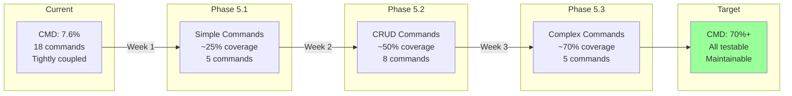

# Phase 5: Command Refactoring Implementation Plan

Based on our successful POC, this plan outlines the systematic refactoring of all CLI commands using dependency injection.

## Executive Summary

The POC demonstrated that we can achieve 100% test coverage on refactored commands while maintaining backward compatibility. This plan applies those learnings across the entire codebase.

## Current State vs Target State



## Implementation Phases

### Phase 5.1: Simple Commands (Week 1)
**Target Coverage: 25%**

Commands to refactor (no external dependencies):
1. **help** - Display help information
2. **completion** - Generate shell completions  
3. **interactive** - Enter interactive mode
4. **root** - Root command setup
5. **config** - Show configuration

**Approach:**
- Start with commands that have minimal dependencies
- Each command should achieve 90%+ coverage
- Update factory for each new command

### Phase 5.2: CRUD Commands (Week 2)
**Target Coverage: 50%**

Commands to refactor (API dependencies):
1. **task** - Create, read, update, delete tasks
2. **space** - Manage spaces
3. **list** - Manage lists
4. **folder** - Manage folders
5. **user** - User operations
6. **comment** - Manage comments
7. **goal** - Manage goals
8. **webhook** - Manage webhooks

**Approach:**
- Implement comprehensive API mocks
- Test all CRUD operations
- Handle error scenarios

### Phase 5.3: Complex Commands (Week 3)
**Target Coverage: 70%+**

Commands to refactor (complex logic):
1. **auth** - Authentication with subcommands
2. **bulk** - Bulk operations
3. **sync** - Synchronization features
4. **export** - Export functionality
5. **import** - Import functionality

**Approach:**
- Break down complex commands into testable units
- Mock file system operations where needed
- Test all edge cases

## Command Refactoring Checklist

For each command:

- [ ] Create command struct extending `base.Command`
- [ ] Move business logic to `run` method
- [ ] Remove direct dependencies (os.Exit, global vars)
- [ ] Add to factory's CreateCommand switch
- [ ] Write comprehensive tests
- [ ] Achieve 90%+ coverage
- [ ] Update documentation

## Testing Strategy

### 1. Unit Tests (Primary Focus)
```go
func TestCommandName(t *testing.T) {
    t.Run("successful execution", func(t *testing.T) {
        // Setup mocks
        mockAPI := mocks.NewMockAPIClient()
        mockOutput := mocks.NewMockOutputFormatter()
        
        // Create command
        factory := factory.New(
            factory.WithAPIClient(mockAPI),
            factory.WithOutputFormatter(mockOutput),
        )
        
        // Execute and verify
        cmd, _ := factory.CreateCommand("commandname")
        err := cmd.Execute(context.Background(), args)
        
        assert.NoError(t, err)
        mockAPI.AssertExpectations(t)
    })
}
```

### 2. Integration Tests (Secondary)
- Test command combinations
- Verify Cobra integration
- Test flag parsing

### 3. Error Scenarios
- API failures
- Invalid inputs
- Missing authentication
- Network timeouts

## Mock Enhancement Plan

Enhance existing mocks to support all commands:

### API Mock
- [ ] Add method recording for verification
- [ ] Support error injection
- [ ] Add response builders for common scenarios

### Auth Mock
- [ ] Token expiration simulation
- [ ] Multi-workspace support
- [ ] Authentication failure scenarios

### Output Mock
- [ ] Capture all output types
- [ ] Format verification
- [ ] Color/quiet mode testing

## Migration Guide

### Step 1: Analyze Command
```bash
# Identify dependencies
grep -n "os.Exit\|log.Fatal\|api.NewClient" cmd/commandname.go

# Check for global variables
grep -n "var.*=" cmd/commandname.go
```

### Step 2: Create New Structure
```go
// internal/cmd/factory/commandname.go
type CommandNameCommand struct {
    *base.Command
}

func (f *Factory) createCommandNameCommand() interfaces.Command {
    cmd := &CommandNameCommand{
        Command: &base.Command{
            Use:   "commandname",
            Short: "Short description",
            Long:  "Long description",
            API:    f.api,
            Auth:   f.auth,
            Output: f.output,
            Config: f.config,
        },
    }
    cmd.Command.RunFunc = cmd.run
    return cmd
}
```

### Step 3: Move Logic
- Extract business logic from cobra.Command.Run
- Convert to use injected dependencies
- Handle errors with returns instead of os.Exit

### Step 4: Write Tests
- Test happy path
- Test error scenarios
- Test flag combinations
- Verify output formatting

## Success Metrics

### Coverage Goals
- Phase 5.1: CMD package reaches 25%
- Phase 5.2: CMD package reaches 50%
- Phase 5.3: CMD package reaches 70%+
- Overall project: Maintain 40%+ coverage

### Quality Metrics
- All refactored commands have 90%+ individual coverage
- Zero os.Exit calls in refactored code
- All commands support structured output (JSON/YAML)
- Consistent error handling across commands

## Risk Mitigation

### Backward Compatibility
- Keep existing command interfaces unchanged
- Maintain flag names and behaviors
- Preserve output formats

### Incremental Migration
- Refactor one command at a time
- Keep old code until new code is tested
- Run parallel testing during migration

### Testing Confidence
- Each PR must maintain or increase coverage
- Manual testing checklist for each command
- Integration test suite for critical paths

## Timeline

### Week 1: Simple Commands
- Day 1-2: help, completion
- Day 3-4: interactive, root
- Day 5: config, documentation

### Week 2: CRUD Commands  
- Day 1-2: task (most complex)
- Day 3: space, list
- Day 4: folder, user
- Day 5: comment, goal, webhook

### Week 3: Complex Commands
- Day 1-2: auth (with subcommands)
- Day 3: bulk operations
- Day 4: sync
- Day 5: export/import, final cleanup

## Next Steps

1. Begin with `help` command refactoring
2. Create PR for each 2-3 commands
3. Update coverage reports daily
4. Adjust plan based on findings

## Conclusion

This phased approach ensures systematic improvement while maintaining stability. Each phase builds on the previous, with clear milestones and measurable outcomes. The POC has proven the approach works - now we execute at scale.